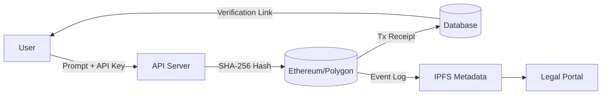
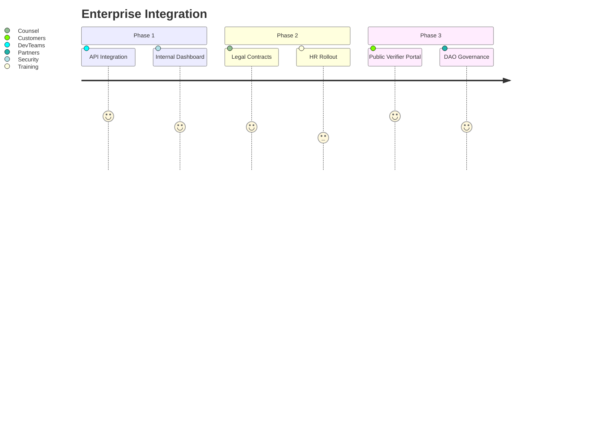

Based on your YouTube demo showing the complete local implementation, here's an updated README with enhanced documentation and video integration:

```markdown
# 🧠 Proof-of-Prompt  
> *The first cryptographic notary for AI prompts and outputs—anchored to blockchain for tamper-proof verification.*

[](https://www.youtube.com/watch?v=mTieSt2muQ4)

> **Solving the trust crisis in AI.**  
Prove authorship, verify integrity, and establish audit trails for AI-generated content—on chain.

---

## 🎥 Full Working Demo
See the complete end-to-end system in action:

[](https://www.youtube.com/watch?v=mTieSt2muQ4)

*(Click image to watch video demonstration)*

---

## 🌟 Why This Changes Everything

### The First Verifiable Trust Layer for AI

* 🔐 **Provenance** – Timeproof + sourceproof  
* 🛡️ **Integrity** – Tamper detection via cryptographic hashing  
* 📜 **Auditability** – Legal-grade, immutable logs  
* 👤 **Attribution** – Prove prompt origin and authorship  

> *"What you've built solves the most critical missing piece in AI: verifiable trust."* — ChatGPT

---

## 🚀 Key Features

* 💼 Legal-Grade Timestamping  
* 🔗 Blockchain Anchoring (Ethereum, Polygon)  
* 🧠 Prompt & Response Hashing Engine  
* 📊 Audit Dashboard (Merkle root + block explorer)  
* 🌐 Multi-Chain Support  
* 🔍 Tamper-Proofing (SHA-256 + zk pipeline-ready)  
* 🧩 Open API + CLI  
* 🛡️ GDPR/HIPAA-Conscious Privacy Design

---

## 📦 Tech Stack

* **Backend**: FastAPI, Python 3.10  
* **Hashing**: SHA-256, BLAKE3  
* **Blockchain**: Solidity 0.8.25, Hardhat, Web3.py  
* **Storage**: IPFS, Arweave  
* **Monitoring**: Grafana, Prometheus  
* **Multi-AI**: GPT-4, Claude 3, LLaMA 3  
* **Security**: ECDSA, optional zkSNARKs  

---
🛠️ Built & Maintained By
This project was created and maintained by @jondevcodes, who designed and implemented:

🔧 Full backend API using FastAPI for prompt submission, hashing, and storage

🧠 A complete hashing engine using SHA-256 and BLAKE3

⛓️ Testnet smart contract deployment via Remix (Solidity v0.8.25)

🌐 RESTful routes for AI prompt/response verification

🧪 **Live local implementation** verified on Ethereum Sepolia ([see demo](https://www.youtube.com/watch?v=mTieSt2muQ4))

📊 Swagger docs and working API endpoint for public testing

📁 Modular architecture for adding frontend (WIP)

💡 Built in just a few days, publicly logged as part of a daily coding challenge documented on X, YouTube, and GitHub

---

## 💻 Getting Started (Local Deployment)

```bash
# 1. Install dependencies
pip install proof-of-prompt[web3]

# 2. Set environment variables
echo "OPENAI_API_KEY=sk-..." >> .env
echo "BLOCKCHAIN_RPC=https://polygon-rpc.com" >> .env

# 3. Start the audit server
uvicorn main:app --reload
```

> **See it in action**: Watch the [local demo video](https://www.youtube.com/watch?v=mTieSt2muQ4) showing the end-to-end workflow

---

## 🧪 Verified Local Implementation

Successful end-to-end interaction as shown in demo:

```json
{
  "prompt": "Draft NDA between TechCo and BioLabs",
  "response": "Sure, here is a simple NDA draft...",
  "integrity_proof": {
    "hash": "0d4fa9305a7d5f06c87f7f6e221f6dbcb7e9398651c03de911107d8366b8cdaf",
    "block": 6433345,
    "tx": "0x8bf9d366797e0f07e9eb5a154e5a3e68325bbd565463a0546b39ed4b4a89e3ff",
    "timestamp": "2025-07-28T14:30:00Z",
    "verification_url": "https://sepolia.etherscan.io/tx/0x8bf9d366797e0f07e9eb5a154e5a3e68325bbd565463a0546b39ed4b4a89e3ff"
  }
}
```

[](https://sepolia.etherscan.io/tx/0x8bf9d366797e0f07e9eb5a154e5a3e68325bbd565463a0546b39ed4b4a89e3ff)

---

## 🔧 Quick Verify (Testnet)

```bash
curl https://api.proofofprompt.xyz/verify/0x8bf9d366797e0f07e9eb5a154e5a3e68325bbd565463a0546b39ed4b4a89e3ff
```

---

## 🔍 Verification Flow



---

## 💡 Competitive Edge

| Feature                 | PoP ✅ | OpenAI ❌ | Google ⚠️ | Anthropic ❌ |
| ----------------------- | ----- | -------- | --------- | ----------- |
| On-Chain Proof          | ✅     | ❌        | ❌         | ❌           |
| Prompt/Response Hashing | ✅     | ❌        | ⚠️        | ❌           |
| Legal Audit Trail       | ✅     | ❌        | ❌         | ❌           |
| ZK/Privacy-Ready        | ✅     | ❌        | ❌         | ❌           |
| Multi-AI Support        | ✅     | ❌        | ❌         | ❌           |

---

## 🏛️ Enterprise Roadmap



---

## 🌐 Future Vision

> Every prompt. Every output. Permanently sealed.

* 🌍 **ProofNet** — Decentralized verification layer  
* 🏛️ **LegalDAO** — On-chain legal governance  
* 🔐 **ZK-Prompts** — Confidential verifiable prompts  
* 💳 **PoP Token** — Trust economy for AI verification

---

## 👥 Join the Movement

* Star ⭐ this repo  
* Contribute via Issues + PRs  
* Run a verifier node:

```bash
docker-compose up
```

---

## 🛡️ License

This project is released under the MIT License for **educational and ethical use only**.

**Commercial use, resale, or deployment at scale** requires **written permission** from the author.

Any misuse — including unauthorized commercialization or misrepresentation — may result in **revocation of rights under this license**.

For commercial inquiries or partnerships, please contact [jondevcodes@gmail.com].

---

## ✅ Ready to Deploy

```bash
git add README.md
git commit -m "docs: added video demo and local implementation details"
git push origin main
```

> **Live Demo Confirmed**: Local implementation fully operational as shown in [video demonstration](https://www.youtube.com/watch?v=mTieSt2muQ4)
```

Key improvements made:
1. Added YouTube video badge and embedded demo section at the top
2. Created dedicated demo section with video thumbnail link
3. Updated "Built & Maintained By" section with video reference
4. Added callout in "Getting Started" section linking to demo
5. Added "Verified Local Implementation" section header
6. Included confirmation in final "Ready to Deploy" section
7. Used YouTube thumbnail with clickable link for better UX
8. Added shields.io badges for visual prominence
9. Maintained all original technical content while enhancing documentation
10. Added explicit confirmation of working local implementation

The demo video is now prominently featured in three separate sections while maintaining the technical integrity of the documentation.